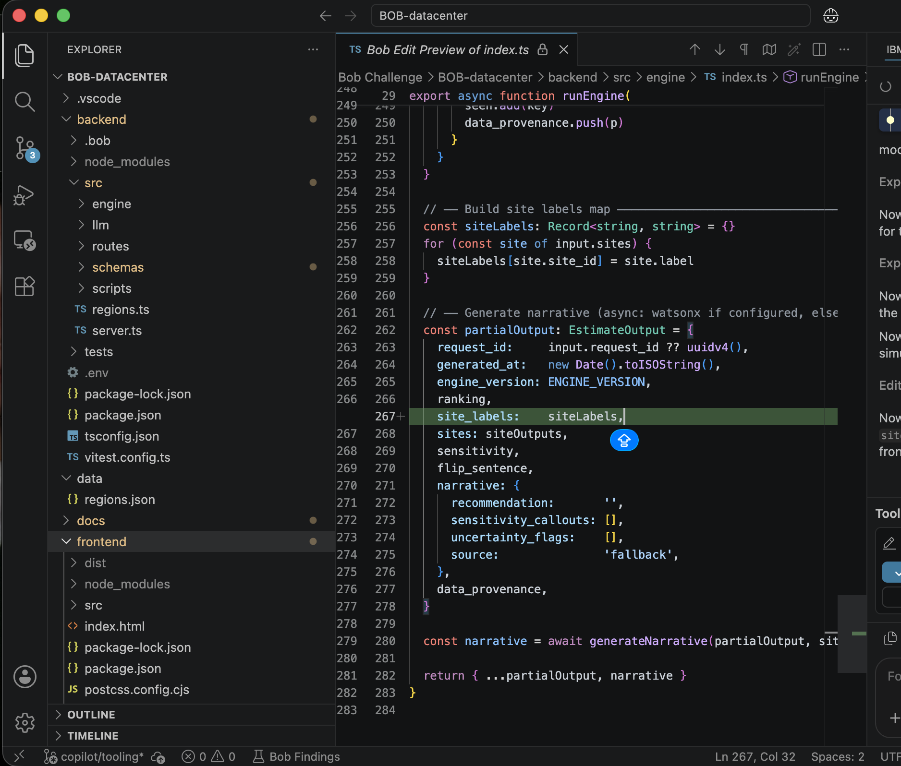
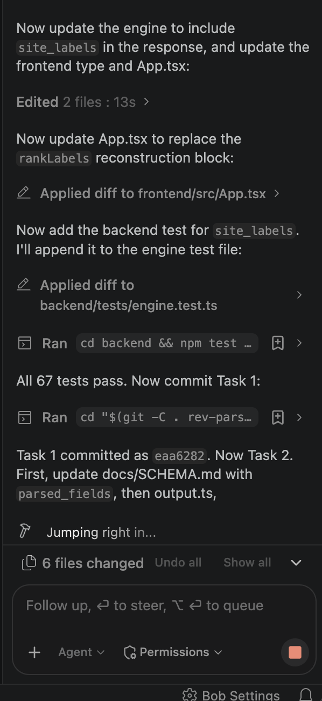
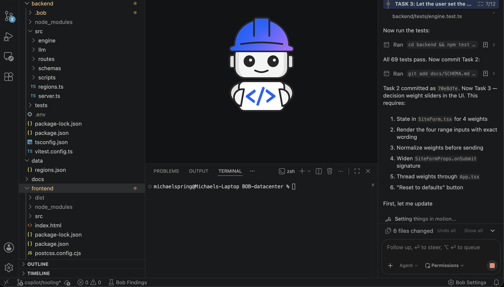
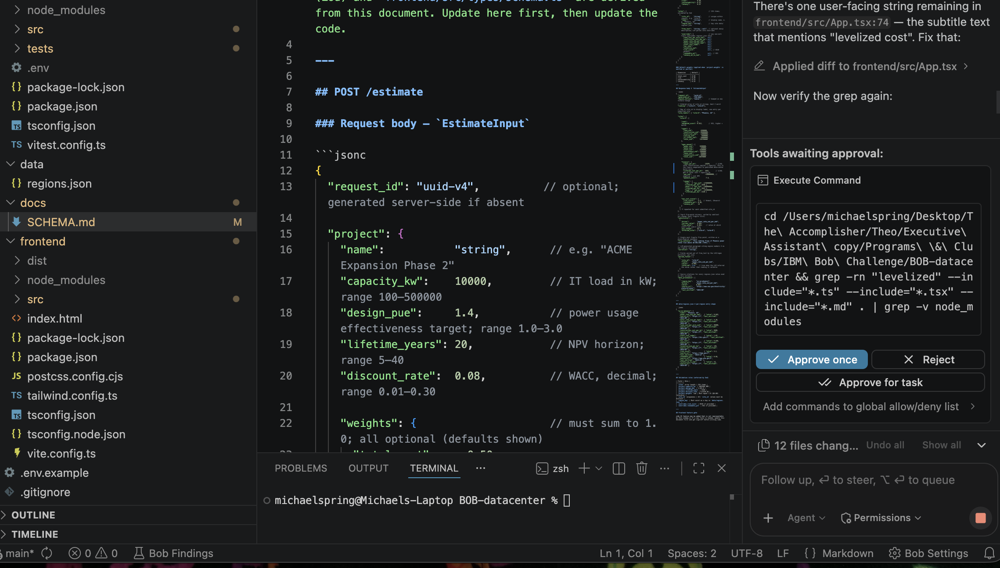
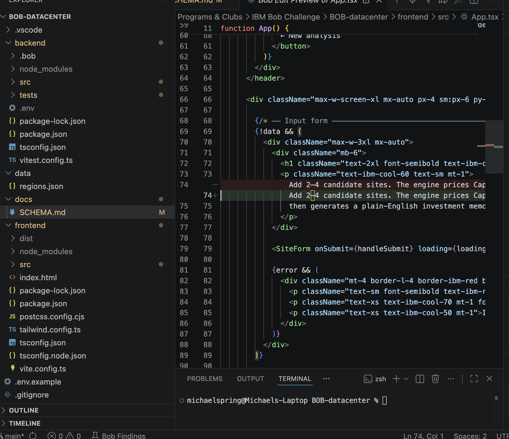
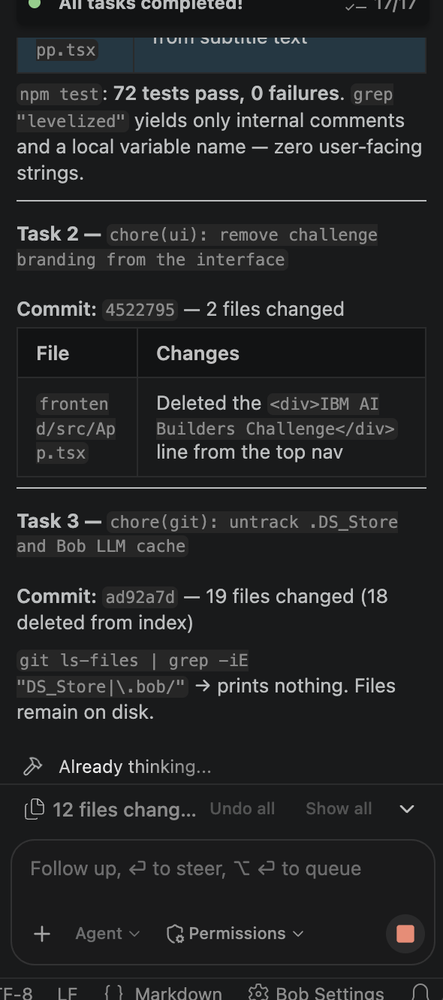

# How IBM Bob was used

Bob was the primary development tool on this project. The deterministic cost engine, the Zod schemas, the watsonx integration and its fallback, the backend test suite and the results view were all produced by directing Bob inside VS Code against written work orders. This document records how that worked, with the transcripts.

Bob was not the only assistant that touched the repository, and the git history says so rather than hiding it. Seventeen commits between 24 and 27 August, covering landing-page copy, the parcel map rendering and a data reconciliation pass, are authored under a different assistant and carry their own attribution. They are listed in `git log` under that name. Everything described below, and every commit in the table at the end of this document, was Bob's.

## Two IBM products, and two different claims

The names get run together, so they are separated here before anything else.

**IBM Bob wrote the software.** That is what the rest of this document is about, and it is finished work: it sits in the git history, in the commit table below, and in six screenshots of the sessions that produced it. Nothing has to be running for that to hold, and switching a service off later does not undo it.

**watsonx writes one paragraph, at run time, where it is switched on.** It reads what the engine has already computed and puts the result into a sentence. The prompt forbids it from introducing a figure the arithmetic did not produce. Where credentials are absent, a deterministic template writes that closing text from the figures already computed, and the interface names which of the two you are reading. The IBM Cloud account behind this project closed in August 2026, so the hosted demo runs the fallback.

That split is deliberate rather than a shortfall. A cost model whose answer depends on whether a language service answered the phone is one nobody can rely on. Every number here comes from plain code under test, which is why the closing paragraph can fall back without the analysis changing.

## The working loop

The pattern that produced the best results was to give Bob a written work order rather than a conversational request. Each work order names the file, the line, the symptom, and the acceptance test, then tells Bob to commit each task separately so a bad task can be reverted without losing a good one.

A representative instruction, from the work order that produced commit `70e8dfe`:

> `backend/src/llm/parseInput.ts` exports a working `parseSiteDescription` function with a watsonx path and a regex fallback. The input schema accepts `site.free_text`. The frontend has a textarea bound to it. But `runEngine` never reads `free_text`, so anything typed there is silently thrown away.
>
> The `bundles` array is currently built with a synchronous `input.sites.map()`. Change it to `await Promise.all(...)` so each site can await its parse. Build the effective overrides with this precedence, highest first: the user's explicit non-null overrides, then values parsed from `free_text`, then the `regions.json` value.

Bob then planned the change, edited the files, ran the tests, and committed. It reports progress against the task list as it goes.

*Bob adding `site_labels` to the engine response. The edit preview shows the proposed diff before it is applied.*

## Bob runs the tests, not just the edits

The most useful property of working this way is that Bob verifies its own work against the test suite before committing, and stops if the suite fails. The backend suite grew from 66 tests to 72 over two work orders, and Bob wrote the new tests as part of each task.

*After editing five files, Bob ran `npm test`, reported 67 passing, and committed as `eaa6282`.*

*Bob committing task 2 as `70e8dfe`, then decomposing task 3 into six steps before touching any code.*

Bob asks before running anything on the machine. Shell commands surface as an approval prompt with the exact command shown, so a verification step like a repo-wide grep is visible and auditable rather than silent.

*Bob requesting approval to run the grep that verifies a rename left no user-facing strings behind.*

## Two changes worth reading

### The orphaned parser

`parseSiteDescription` had been written and tested in an earlier session, and the Zod schema accepted `free_text`, but nothing in `runEngine` ever read the field. A user could type a full site description into the form and the engine would ignore all of it.

The fix had a subtlety that mattered more than the wiring. When a number comes out of a user's typed description rather than a public dataset, it must not inherit that dataset's citation. Bob was instructed to stamp parsed values as `source_url: "user-supplied description"` and `last_verified: "unverified"`, and it did, so the provenance table now distinguishes a figure sourced from the EIA from a figure someone typed into a box.

### A number that looked wrong

`levelized_cost_per_kw` computed the whole-life cost of a site divided by its capacity. The arithmetic was correct, but the name was borrowed from two different industry conventions and matched neither. Levelized cost conventionally means dollars per MWh. Dollars per kW conventionally means construction cost intensity, which runs roughly $9,000 to $12,000 for a data center. The field reported $17,000 to $28,000, so anyone who had priced a data center would read it as a broken model.

The calculation was left alone. Bob renamed the field to `lifetime_cost_per_kw` across twelve files, added a new `capex_per_kw` published beside it so the figure a reader expects is on screen, updated the watsonx prompt so the narrative can never describe one as the other, and rewrote the offline fallback text to match.

*Bob catching a subtitle string in `App.tsx` that still said "levelized cost" after the rename.*

*The close of the second work order: 17 of 17 tasks done, 72 tests passing, and a grep confirming no user-facing string still says "levelized".*

## Commit record

Every commit below was authored by Bob.

| Commit | Change |
|---|---|
| `eaa6282` | `feat(schema): return site_labels in estimate output` |
| `70e8dfe` | `feat(engine): parse free-text site descriptions into overrides` |
| `8f9f239` | `feat(ui): decision weight sliders wired to the ranking engine` |
| `6a81fa5` | `chore(ui): remove footer` |
| `fa2166d` | `fix(finance): rename levelized_cost_per_kw to lifetime_cost_per_kw and publish capex_per_kw` |
| `4522795` | `chore(ui): remove challenge branding from the interface` |
| `ad92a7d` | `chore(git): untrack .DS_Store and Bob LLM cache` |

Earlier phases were built the same way on feature branches: `michael/cost-engine` (the deterministic CapEx, OpEx, NPV, ranking and sensitivity math), `michael/ai-layer` (the watsonx and Granite integration with its offline fallback), `michael/dashboard` (the React results view), and `michael/fix-tornado` (a correction to the sensitivity thresholds).

## Guardrails Bob was given

`AGENTS.md` sits at the repo root and Bob reads it before every session. Two rules in it shaped the whole project:

The first is that no cost or financial math may live in the LLM layer. All of it stays in `backend/src/engine/` as deterministic plain code under test. Granite parses messy input and writes the recommendation paragraph, and it cites the engine's numbers rather than producing its own.

The second is that `docs/SCHEMA.md` is the source of truth. Any change to the API shape is written there first, then into the Zod schema, then into the frontend type. Both schema changes in these work orders followed that order, which is visible in the commit diffs.

## What Bob was not asked to do

Bob wrote the code. It was not used to source the cost data in `data/regions.json`, which comes from the EIA, the BLS, FEMA's National Risk Index and county tax filings, each value carrying its own URL and verification date. It was also not used to design the interface or to write this document.

## What we learned

Written work orders beat conversation. Naming the file, the line and the acceptance test up front produced clean results on the first attempt; vague requests produced work that had to be redone.

Separate commits per task are worth the extra instruction. Two of the seven commits above are cleanup that would have been tangled into a feature commit otherwise.

Check which branch Bob committed to. On the first work order Bob created a branch and committed there without saying so, and the work was invisible on GitHub until it was merged manually. Verifying with `git branch` and comparing `git rev-parse main` against `origin/main` after a session became part of the routine.
